# DDNS Token for Raspberry Pi Pico W

## This project is a code written in Python that enables Raspberry Pi Pico W to be used as a DDNS client.  
### To use this project, the following preparations are required. 
 
- The DNS service that supports DDNS, the DDNS service. 

    Supported (D)DNS service are as follows.

    > Google : https://domains.google.com/
    > GoDaddy : https://www.godaddy.com/
    > Cloudflare : https://www.cloudflare.com/
    > Duck DNS : https://www.duckdns.org/
    > No-IP : https://www.noip.com/
    > ClouDNS : https://www.cloudns.net/
    > FreeDNS : https://freedns.afraid.org/
    > ImDNS : https://imdns.org/
 
- Raspberry Pi Pico W : 

https://www.raspberrypi.com/documentation/microcontrollers/raspberry-pi-pico.html 
 
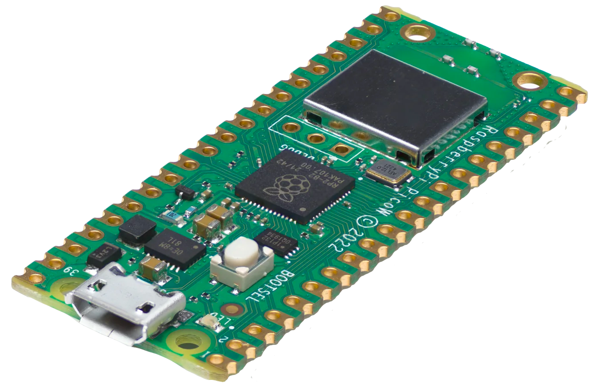 

 
- DDNSToken Configurator 

https://github.com/DDNSToken/config 
 
This project for installing Raspberry Pi Pico's firmware and configuring DDNS service. It is written in Javascript and can be run or compiled with Electron. 
 
This program can be used in Microsoft Windows, Apple Mac OS and Linux environments. 
 
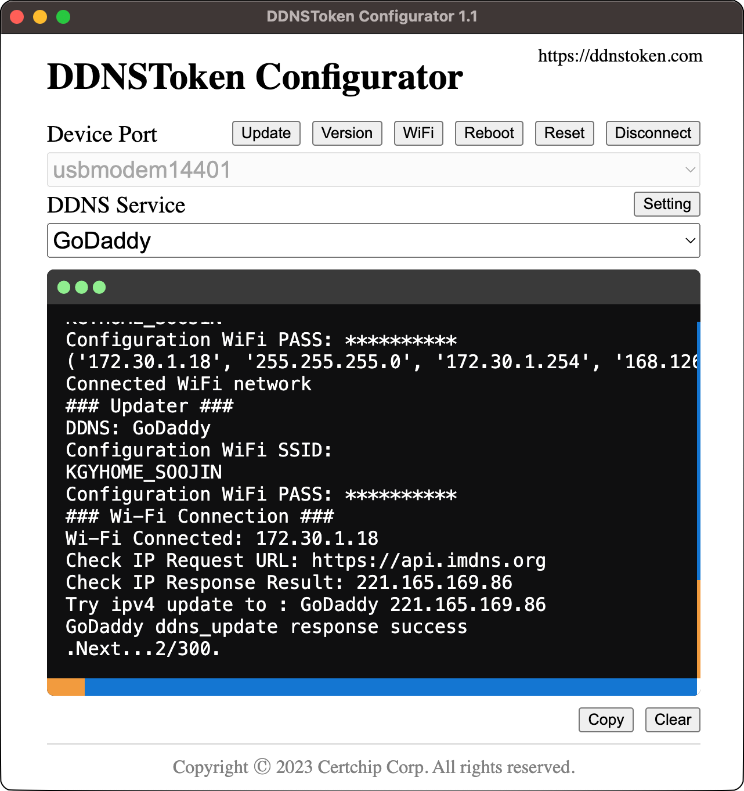 
 

# How to Install on Raspberry Pi Pico W

## MicroPython
To use Python on Raspberry Pi Pico W, you need to install MicroPython on Raspberry Pi Pico W. 
In addition, we have partially modified the MicroPython project to install and run DDNSToken and share it on Github. Please refer to the following Github link for this code. 

https://github.com/DDNSToken/micropython 

MicroPython projects are implemented in C. If your environment cannot perform C compilation, you can download and use the compiled code from the following Github repository. 

https://github.com/DDNSToken/release 

This document uses compiled MicroPython for explanation. 

## Install MicriPython on your Raspberry Pi Pico W
>
> Download the <b>firmware.uf2</b> file using the link below. 
> https://github.com/DDNSToken/release/raw/main/pico-w/firmware.uf2 
> 
> While holding down the BOOTSEL button of the Raspberry Pi Pico W, connect it to the USB port of the PC. After connecting to the PC, release the BOOTSEL button. 
>
> A disk named RPI-RP2 is mounted on your PC as follows. In my case, I use macOS, it is displayed as shown in the following picture. Although the display is different in Windows or Linux environments, I think you can fully understand it because the contents are the same. 
>
> 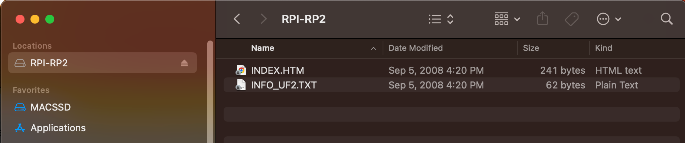  
> Copy the downloaded <b>firmware.uf2</b> file to the mounted RPI-RP2 drive. 
> When the copying is complete, it is automatically unmounted and the Raspberry Pi Pico is rebooted. 
>
> If you want to replace the firmware on your Raspberry Pi Pico W with another firmware, you can follow the above process. 

 
 

## Install the DDNSToken Module into Raspberry Pi Pico W
>
> Inside the build directory of this project you will find files of the form ddnstoken.<i>v1.v2.v3</i>.fwm. This file is created by the build.sh shell script. 
> 
> 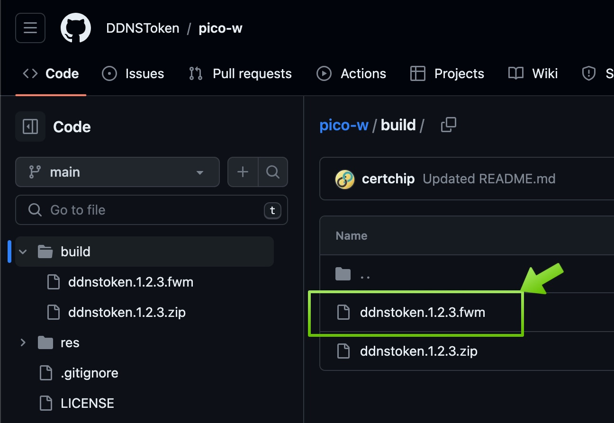  
> 
> You can update this firmware module file (*.fwm) to the Raspberry Pi Pico W using the DDNSToken Configurator app. 
>
> DDNSToken Configurator app is written in JavaScript and can be executed using Electron. This project is shared on Github, please refer to the following link address. 
>
> https://github.com/DDNSToken/config
>
> If you are not using Electron, you can easily install the DDNSToken Configurator app using the installation image from the following Github repository.
> 
> https://github.com/DDNSToken/release
> 
> The provided installation image is as follows. 
> macOS, Windows, Linux
>
>Therefore, the DDNSToken Configurator app can operate on various OS platforms.  
>
> 1. Run the DDNSToken Configurator app. 
> 2. Connect Raspberry Pi Pico W with firmware.uf2 installed to computer USB. 
> 3. Press the [Scan] button, USB ports are searched for the DDNS Token device. 
>  
> 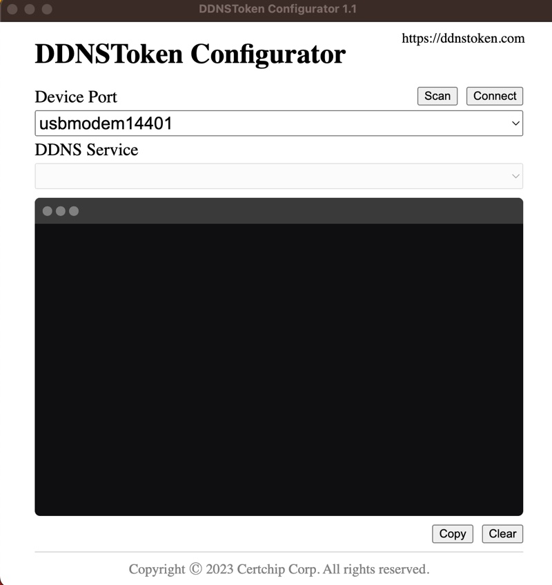  
>  
> 4. Press the [Connect] button, the following output is displayed because the DDNSToken device is in the initialization state as shown below. 
>  
> 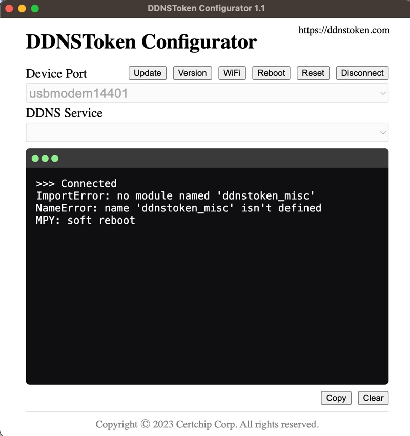  
>  
> 5. We could create the fwm (Ex; ddnstoken.1.2.3.fwm) file in the above process or download it from Github.  
> 6. Click the [Update] button to select the downloaded fwm file to proceed with the update. 
>  
> 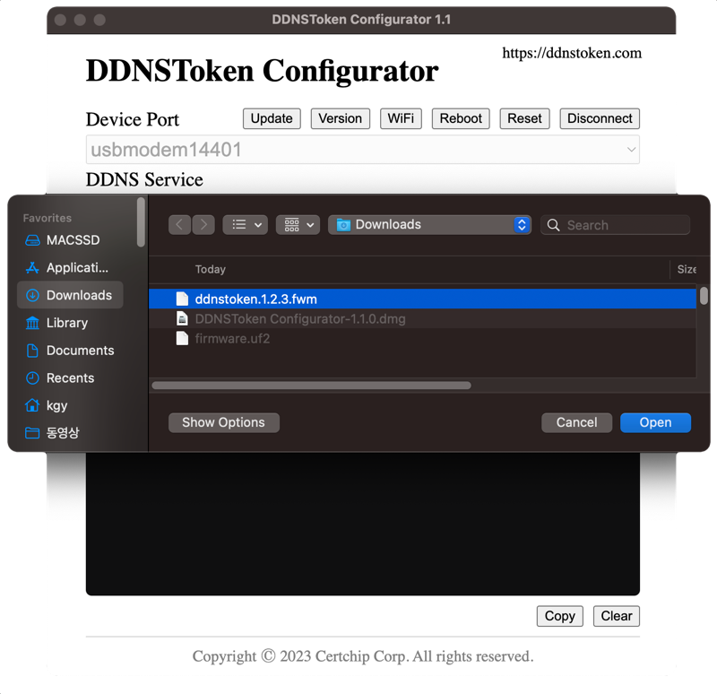  
> 7. When the update is completed, Soft Reboot is automatically executed and you can see the following output. 
>  
> 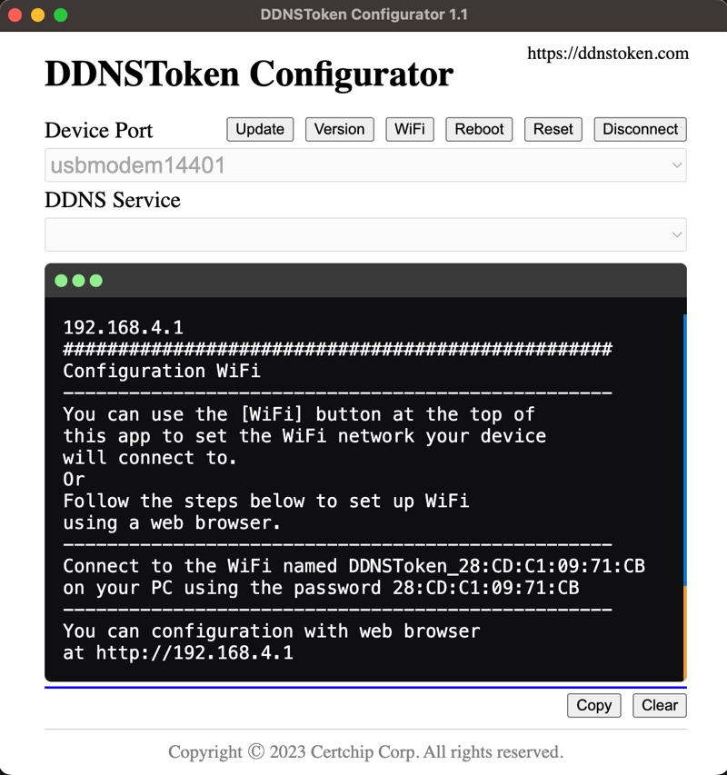  
>  
> 8. Click the [WiFi] button to connect your Raspberry Pi Pico W to your WiFi network. 
>  
> 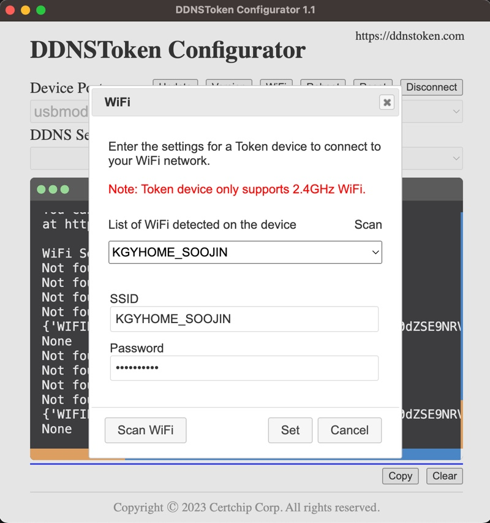  
>  
> If your WiFi network SSID is not searched, you can search again by clicking the [Scan WiFi] button. 
> Raspberry Pi Pico W only supports 2.4GHz. 
>  
> 9. Click the [Set] button to complete WiFi setup. 
>  
> 10. When the WiFi connection is complete, try connecting to the DDNS service using the connected WiFi network.
>  
> If the DDNS service is not configured, the following message will be displayed. 
>  
> 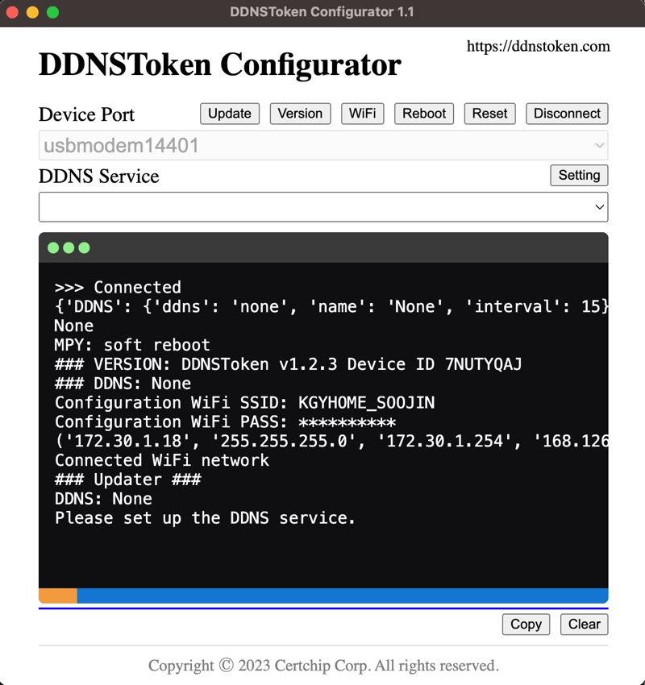 
>  
> 11. You can select the list of currently supported DDNS services as follows by clicking the combo box of the DDNS Service item.
>  
> We'll be using "Duck DNS" as a sample for this article. 
>  
> 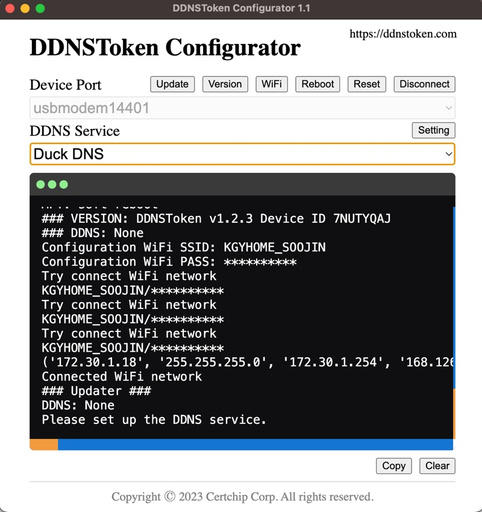  
>  
> 12. To complete the setup, you first need to know your domain information from duckdns.org. 
> What you need to check is your domain and token value. 
>  
> 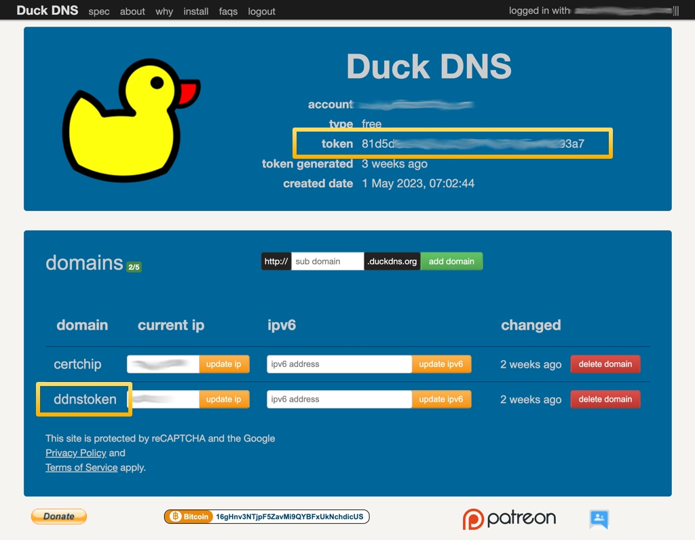  
>  
> 13. You can set the selected DDNS Service by using the [Setting] button. 
> Items to set are different depending on the selected DDNS service. 
>  
> 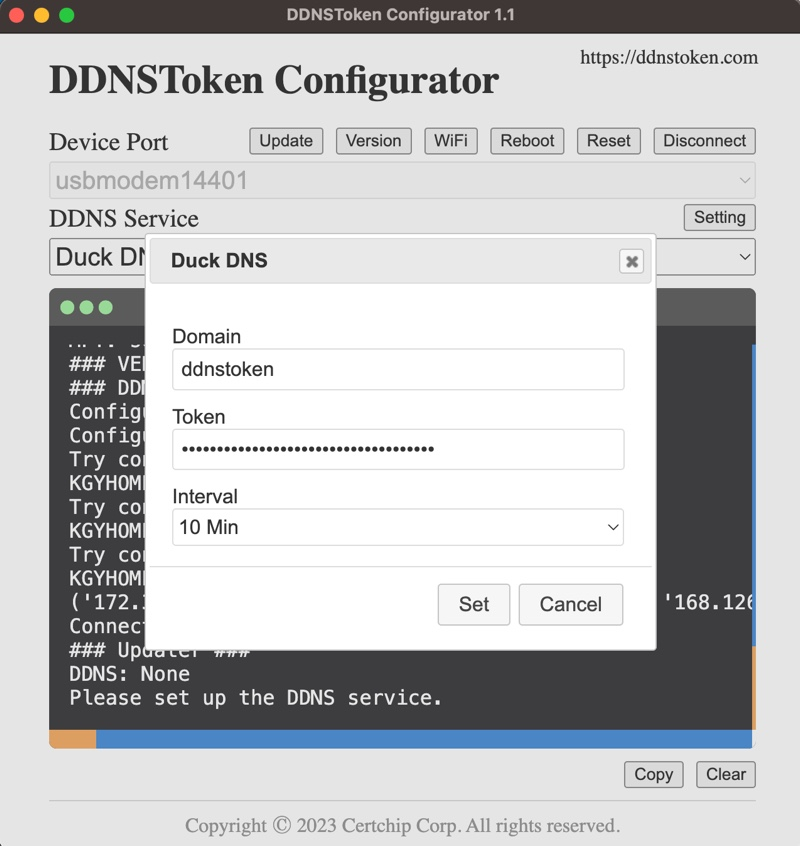  
>  
> 14. If all settings are complete and the network is normal, your IP will be updated on the DDNS service. 
>  
> 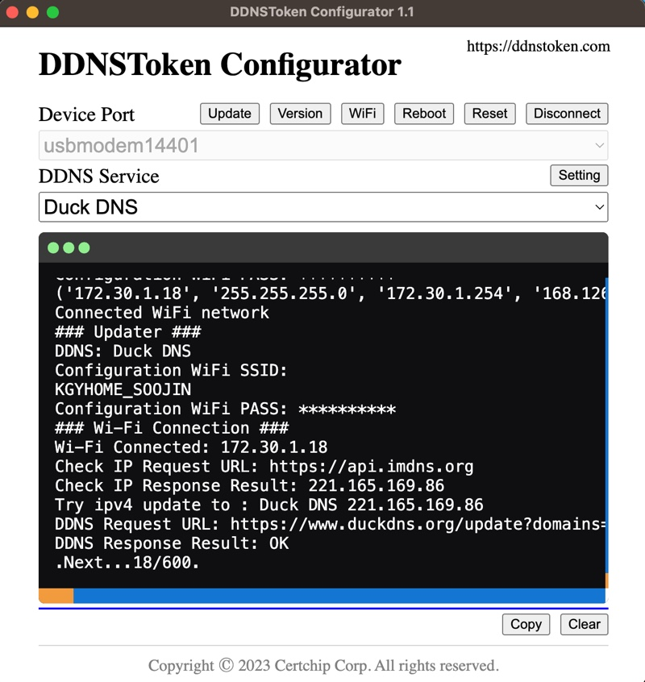  
>  
> DDNSToken basically updates the IP to the DDNS service when power is restarted. 
> When the power is kept ON, the IP is checked at set intervals, and if the IP is determined to be changed, the IP is updated to the DDNS service again. 
>  
> 15. IP has been updated by Raspberry Pico W. 
>  
> 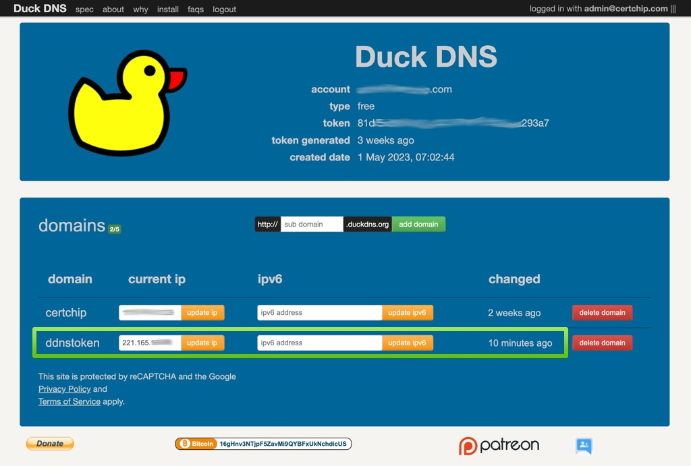  
>  

 

# How to Use

If you have installed the software on the Raspberry Pi Pico W and completed the WiFi and DDNS service settings as above, the DDNS update will proceed automatically just by turning on the power of the Raspberry Pi Pico W. 

 

# Contribute
Perhaps you can write code to support other DDNS services based on this project. If you write code to support other services, please share with us. 
 
If you would like to contribute to this project, please send an email to admin@certchip.com. 
 
Thank-you

